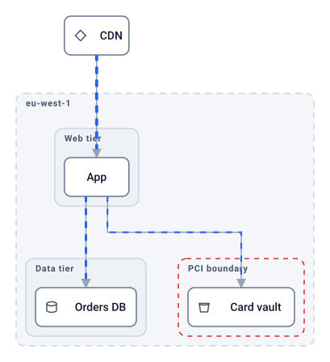

# Orrery

> An orrery is a mechanical model of the solar system. You crank it and watch the parts move.

**Orrery makes architecture diagrams that are models, not pictures.** Written as JSON by AI agents,
laid out automatically, rendered to a single SVG that animates in a GitHub README with no plugin.

Orrery's first diagram is, naturally, an orrery.


*A plain SVG file in an image tag. Dash speed and thickness follow each connection's `load`: the Sun pours heat into Venus,
Earth gets a steady stream of sunlight, Mars a trickle of solar wind, and the Moon mostly gets tides.*

A more terrestrial example, a checkout service with tiers, a region, and a worker queue, is below.

## What it does

Every diagram below is a plain SVG in an image tag, small enough to read on a phone. Sources are in
[examples/readme](examples/readme).

**Kinds.** The default component kinds, each with a glyph: client, gateway, service, database, cache, queue, function,
storage, external. Define your own with a path and a box style.



**Nested groups.** Tiers, regions, zones, clusters and trust boundaries by default, each with a distinct frame, or your
own. The hierarchy is also the outline for navigation, and a group can be connected, needed and given a state.



**Connection kinds and load.** Sync, async, replication and dataflow connections are drawn differently. Load drives
the speed and weight of the flow.



**Failure scenarios.** Components declare what they need, with alternatives. A scenario marks one component failed
and the tool works out the rest: the worker fails with the primary, the API degrades onto its replica, the web tier
degrades behind the API, and traffic moves off the dead paths. This image plays the scenario itself, healthy then
failed, every three seconds with no script: the steps are pre-rendered layers switched by CSS. The interactive file
plays the same steps on a timer until you click.



```sh
orrery render examples/readme/failover.orrery.json --scenario db-fails -o failed.svg    # one step, still
orrery render examples/readme/failover.orrery.json --play db-fails --every 3 -o play.svg   # every step, on a loop
```

**Views.** One model, many drawings. A view can drill into a group and choose its own direction.





**Drill down.** A view can draw a group closed: its real footprint with its name and a count, members hidden until the
group is in focus. Everything is one drawing, so opening a group is a camera move, not a new picture: the closed box
keeps its name and its connections while the camera closes on it, and its members resolve once the camera has settled,
the way a map resolves as you approach. This image plays a four-scene story with no script: the camera closes on
Orders and its members appear, the database fails in there, and the camera pulls back to the overview with the closed
box and the app that needs it turned red. A `tour` in the model is a list of scenes, each a view at a moment, optionally
focused on a group; the interactive file plays the same scenes with its camera until you click, and a click on any
closed group focuses it. A larger platform with nested groups plays the same way in
[drill-down-tour.svg](examples/readme/drill-down-tour.svg).



**Your vocabulary.** States and kinds are yours to name: bind them to looks and mechanics, and the legend teaches the
reader your words. A trading platform whose organisation says healthy, impaired, brownout, outage and drained, two
sequencers into a quorum loss:



**Interactive.** The same SVG file, opened directly instead of through an image tag, runs a small embedded runtime:
an outline to navigate, click a component to fail it and watch the cascade, step through scenarios, switch views with
a morph, keyboard shortcuts. No page, no build, no server. Try the checkout example:
[open it interactive](https://cdn.jsdelivr.net/gh/adamgilman/Orrery@main/examples/checkout.svg)
(served with the right content type by jsDelivr; GitHub's raw links serve SVG as text).


## Status

The model is specified in [docs/MODEL.md](docs/MODEL.md) and the file is interactive. Next: sequence and walkthrough
views, GIF export, and an MCP server. See the [PRD](PRD.md).

## Quick start

```sh
yarn install && yarn build
yarn orrery validate examples/three-tier.orrery.json
yarn orrery render examples/three-tier.orrery.json -o out.svg            # interactive when opened directly
yarn orrery render examples/three-tier.orrery.json --static -o out.svg   # one view, no runtime
```

`yarn orrery` runs the CLI from the checkout; the commands below write `orrery` for short.

## Writing a model

```json
{
  "$schema": "https://raw.githubusercontent.com/adamgilman/Orrery/main/packages/core/schema/v1.json",
  "direction": "down",
  "groups": [ { "id": "data", "label": "Data tier" } ],
  "components": [
    { "id": "web", "kind": "gateway", "needs": ["api"] },
    { "id": "api", "label": "Checkout API", "needs": [ { "any": ["orders", "replica"] } ] },
    { "id": "orders",  "label": "Orders DB", "kind": "database", "group": "data" },
    { "id": "replica", "label": "Replica",   "kind": "database", "group": "data" }
  ],
  "connections": [
    { "from": "web", "to": "api", "load": 0.8, "label": "HTTPS" },
    { "from": "api", "to": "orders", "load": 0.6 },
    { "from": "api", "to": "replica", "load": 0 },
    { "from": "orders", "to": "replica", "kind": "replication", "load": 0.2 }
  ],
  "scenarios": [ { "id": "orders-down", "steps": [
    { "note": "Primary goes down", "set": { "failed": "orders" } },
    { "note": "Recovered",         "restore": "orders" } ] } ]
}
```

The file grows progressively: components alone render; connections add flow; `needs` make connections matter;
alternatives, quorum and outcome states enrich them; scenarios record what-ifs; views drill in. Try any what-if
without a scenario:

```sh
orrery render app.json --set failed=orders
```

The default states (`on`, `degraded`, `failed`, `off`) and kinds are a preset. A `states` block binds your own
names to looks (preset or custom style) and mechanics (rank, availability, flow, cascade); a `kinds` block does the
same for component and group kinds. The engine never reads a name.

Rules an agent needs to know:

- Never write coordinates. Layout is automatic and deterministic; `direction` is the only hint.
- Order in the file is order on the canvas within a rank, so list the important things first.
- Connections carry no health semantics. A component's `needs` do, and every need must have a connection.
- Unknown properties are errors, on purpose. Run `validate` and fix what it lists: each line is a JSON pointer and a message.

The specification, with every invariant, is [docs/MODEL.md](docs/MODEL.md).

## Development

Test-driven, no exceptions. Every behaviour lands as a failing test first.

```sh
yarn test                                   # builds, then runs unit, contract, snapshot, pixel and CLI e2e tests
yarn inspect examples/checkout.orrery.json  # renders, freezes animation frames to PNG, checks them, writes a contact sheet
ORRERY_SKIP_BUILD=1 yarn vitest run packages/core   # source-only suites without the build step
```

Layout runs through the `LayoutEngine` interface. The Eclipse Layout Kernel adapter in `packages/layout-elk`
is the only package allowed to import elkjs; a test enforces that so the engine can be replaced.

## License

MIT
