# Orrery

[](https://github.com/adamgilman/Orrery/actions/workflows/ci.yml) [](LICENSE) [](https://adamgilman.github.io/Orrery/)

> An orrery is a mechanical model of the solar system. You crank it and watch the parts move.

**Orrery makes architecture diagrams that are models, not pictures.** Written as JSON by AI agents,
laid out automatically, rendered to a single SVG that animates in a GitHub README with no plugin.

Orrery's first diagram is, naturally, an orrery.



*A plain SVG file in an image tag. Dash speed and thickness follow each connection's `load`: the Sun pours heat into Venus,
Earth gets a steady stream of sunlight, Mars a trickle of solar wind, and the Moon mostly gets tides.*

Every other diagram in this README is the same small system, a checkout, built up one stage at a time. The stages are
in [examples/checkout](examples/checkout), each a plain SVG in an image tag, small enough to read on a phone, and each
derived from one master file, [examples/checkout.orrery.json](examples/checkout.orrery.json). Two reference pages,
[the kitchen sink](examples/kitchen-sink/README.md) and [the moving parts](examples/moving-parts/README.md), draw
everything else the vocabulary offers and every way a model moves.

## Building a model, one stage at a time

**1. The parts.** Name the components and give each a kind. Components alone render. The defaults are client,
service, database, cache, queue, gateway, function, storage and external, each with a plain glyph and a shape (a
database is a cylinder, a client a pill, a gateway a hexagon); you can define your own kind with a glyph, a shape
and a box style, and your own shapes as path data (`shapes` in the model, next to `states` and `kinds`); or pull
in a pack. `"kinds": { "use": ["aws"] }` is in this file, so the
API is `aws:fargate`, the databases `aws:rds` and the storefront a plain `client`, and the boxes carry the
provider's own icons. Three packs ship, `aws`, `gcp` and `azure`, every service in each provider's official icon
set under the names people say (`aws:s3`, `gcp:run`, `azure:aks`); `orrery packs aws` lists them, and
[docs/PACKS.md](docs/PACKS.md) carries the providers' terms. The session cache is one part for now; stage 6 opens
it up.



**2. Groups.** Put the parts in tiers, regions, zones, clusters or trust boundaries, nested as deep as the system goes.
A group kind picks a frame style and a shape, so a boundary can be a cloud.
A group can be connected and given a state, and a view can draw it closed: one box the size of a component, with an
expand mark. The session cache is a cluster drawn closed here, so the rest of the story stays small.



**3. Connections.** Draw the lines. Sync, async, replication and dataflow connections are drawn differently (the replica is fed by replication here), and `load`
drives the speed and weight of the flow. The API talks to the session cache as a whole, so that line ends on the
cluster's frame; the failover line to the read replica carries no load yet.


**4. Scenarios.** Say what happens, in your words, and point at it: a step's `callouts` are notes drawn on the
picture for that step. A scenario is a list of steps; each step puts entities in
states, with a reason if you like, and sets the loads that move. Here the primary fails, the API is degraded because
it reads from the replica, the storefront is degraded because checkout is slower, and the failover line carries the
reads. Nothing is worked out for you: every state in the picture is one you wrote, and a failed box stops its flows.
This image plays the scenario itself, healthy then failed, every three seconds with no script: the steps are
pre-rendered layers switched by CSS. The interactive file plays the same steps on a timer until you click.



The pictures a model produces are declared in the file, next to the views and scenarios they draw from, and one
command writes them all, so the images in your docs come from the same commit as the system:

```json
"exports": [
  { "id": "4-scenarios-failed", "scenario": "db-fails", "step": 1 },
  { "id": "4-scenarios-play", "play": "db-fails", "seconds": 3 }
]
```

```sh
orrery export examples/checkout/4-scenarios.orrery.json --out docs/diagrams   # writes 4-scenarios-failed.svg and 4-scenarios-play.svg
```

**5. Views.** One model, many drawings. A view scopes to a group and chooses its own direction; what lies outside is
drawn as a ghost at the edge, so nothing is dropped silently. The data tier, on its own:


**6. Drill down.** One diagram, every level of detail. Start high: the session cache is one small box. Open it and
it grows into a frame, the picture reflows around it, and you are looking at the two nodes it is made of. Open a node
and you are inside that: a Redis process and its append-only file. Close them and everything slides back. The detail
is in the model, folded away until the reader wants it, as many levels deep as the model goes. Opening and zooming are
separate: a scene, a still or a page can open two groups and stay zoomed out, or zoom in on one. This image plays that
as a seven-scene `tour`: the whole system; the cache opened; both nodes opened, still the whole picture; zoom in on
node A; Redis dies; zoom out with everything open; close it all. In the interactive file, click a closed box to open
it, double-click or Enter to zoom, Escape to zoom out and then to close.



**7. Your vocabulary.** States and kinds are yours to name: bind them to looks, and the legend teaches the reader
your words. The same checkout in one company's words, healthy, impaired, brownout, outage and drained. Drain the
cache cluster for maintenance, and this team's story is that checkout runs on for guests, a brownout, while the
storefront behind it is impaired. Line styles are yours too: a `kinds.connections` entry binds a name to a stroke,
width, dash pattern and flow colour.



**8. One request, as a sequence.** Every picture so far is a topology: the entities, the connections between them,
groups as frames. A sequence view is the other drawing of the same model: the messages of one interaction, in order,
between the entities the model already has, over the connections it already declares: a message with no connection under it
is an error. Each participant is its own box, in its state, on a lifeline; a reply is the dashed return and closes
the activation its call opened. The same model, another drawing of it; a scenario step colours the participants
the same way it colours the topology. A sequence is its own drawing, so it is its own file: `render --view checkout-seq`
writes it, interactive like the topology's file, the brackets stepping the messages.



## Two reference pages

Every variant and every movement, drawn from the same checkout, regenerated with the examples:

- **[The kitchen sink](examples/kitchen-sink/README.md)**: every state and look, the default kinds with their
  glyphs and shapes, the group frames open and closed, every line style and load, the eleven shapes and one of
  your own, the cloud packs, replicas, tech lines and ghosts.
- **[The moving parts](examples/moving-parts/README.md)**: views that scope, restrict and close groups; open and
  zoom as separate actions; a scenario stepping through failure and recovery; a what-if; play; the tour; and the
  keys and clicks of the interactive file.

## Orrery, drawn in Orrery

[examples/orrery.orrery.json](examples/orrery.orrery.json) is a model of how Orrery works: an agent writes one
file, the command line validates it, core folds the declared states in, scopes a view and renders it through a
layout engine behind one interface, and pictures come out for a README, a browser and a page. It uses every
feature the model offers, on purpose: the regression suite walks the schema against this file and fails when a
property has no place in it, so a feature cannot be added without drawing it here.





The [tour](examples/orrery/tour.svg) opens the vocabulary two levels down, zooms into the runtime, plays the
mistake and its fix, and ends on what comes next. Every export is in [examples/orrery](examples/orrery).

## Two ways out

**Scenes, for documents.** A model lists the pictures it produces, and one command writes them all as enclosed
SVG files: CSS animation only, no script, so each plays inside an image tag in a README, a wiki or a design doc.
Every picture in this README is one of them.

```sh
orrery export examples/checkout.orrery.json --out docs/diagrams
```

**One diagram, for a page.** For a web page, `embed` writes the model as one SVG with every topology view and every
drill-down, one more SVG per sequence view, the engine as a script, and a sample page. The engine has no user interface of its own: your page
mounts it and builds its controls from what it reports.

```sh
orrery embed examples/checkout.orrery.json --out site/checkout
```

```js
const orrery = Orrery.mount(document.querySelector("svg"));
orrery.views; orrery.scenarios; orrery.states; orrery.groups();   // what the model offers
orrery.showView(id); orrery.open([...groups]); orrery.zoom(id); orrery.back();
orrery.setScenario(id, step); orrery.next(); orrery.prev();
orrery.setState(id, state); orrery.cycle(id); orrery.reset();
orrery.play(); orrery.stop();
orrery.on("change", (snapshot) => { /* view, open groups, scenario step and note, every state and reason, selection */ });
```

The sample `index.html` and `app.js` build a view chooser, a scenario stepper, state buttons for the selected
component, drill-down buttons and play controls from that interface, in plain HTML. Throw them away and wire your
own. Opened directly with no page around it, the SVG is purely the diagram: click a component to step it through
your states, click a closed group to drill in, Escape to step back out, digits to switch views, `s` to start a
scenario and cycle through them, brackets to step it. Try it: [open the checkout](https://cdn.jsdelivr.net/gh/adamgilman/Orrery@main/examples/checkout.svg),
or [its sequence](https://cdn.jsdelivr.net/gh/adamgilman/Orrery@main/examples/checkout-sequence.svg)
(served with the right content type by jsDelivr; GitHub's raw links serve SVG as text). No page, no build, no server. ## Status

The model is specified in [docs/MODEL.md](docs/MODEL.md) and the file is interactive. Next: sequence and walkthrough
views, GIF export, and an MCP server. See the [PRD](PRD.md).

## Quick start

Install the `orrery` command (Node 22 or newer):

```sh
npm install -g orrery-diagrams
yarn global add orrery-diagrams
pnpm add -g orrery-diagrams
bun add -g orrery-diagrams
```

Or run it without installing: `npx orrery-diagrams …`, `pnpm dlx orrery-diagrams …`, `bunx orrery-diagrams …`.

```sh
orrery validate app.orrery.json
orrery render app.orrery.json -o app.svg            # interactive when opened directly
orrery render app.orrery.json --static -o app.svg   # one view, no runtime
orrery export app.orrery.json --out docs/           # every picture the model lists
```

In a project, add it as a dev dependency so the docs build renders the diagrams: `npm install -D orrery-diagrams`,
`yarn add -D orrery-diagrams`, `pnpm add -D orrery-diagrams` or `bun add -d orrery-diagrams`, then `orrery export`
from a script. The libraries are `@orrery-diagrams/core`, `layout-elk`, `runtime` and `raster` for anyone building
on the model directly.

From a checkout:

```sh
yarn install && yarn build
yarn orrery validate examples/checkout.orrery.json
```

`yarn orrery` runs the CLI from the checkout; the commands below write `orrery` for short.

## Writing a model

```json
{
  "$schema": "https://raw.githubusercontent.com/adamgilman/Orrery/main/packages/core/schema/v1.json",
  "direction": "down",
  "kinds": {"use": ["aws"]},
  "groups": [
    {"id": "data", "label": "Data", "kind": "tier"},
    {"id": "sessions", "label": "Session cache", "kind": "cluster", "parent": "data"},
    {"id": "cache-a", "label": "Node A", "kind": "cluster", "parent": "sessions"},
    {"id": "cache-b", "label": "Node B", "kind": "cluster", "parent": "sessions"}
  ],
  "components": [
    {"id": "web", "label": "Storefront", "kind": "client"},
    {"id": "api", "label": "Checkout API", "kind": "aws:fargate"},
    {"id": "db", "label": "Orders DB", "kind": "aws:rds", "group": "data"},
    {"id": "replica", "label": "Read replica", "kind": "aws:rds", "group": "data"},
    {"id": "redis-a", "label": "Redis", "kind": "aws:elasticache", "group": "cache-a"},
    {"id": "aof-a", "label": "Append-only file", "kind": "aws:s3", "group": "cache-a"},
    {"id": "redis-b", "label": "Redis", "kind": "aws:elasticache", "group": "cache-b"},
    {"id": "aof-b", "label": "Append-only file", "kind": "aws:s3", "group": "cache-b"}
  ],
  "connections": [
    {"from": "web", "to": "api", "load": 0.8},
    {"from": "api", "to": "db", "load": 0.6, "label": "writes"},
    {"id": "failover", "from": "api", "to": "replica", "load": 0},
    {"from": "db", "to": "replica", "kind": "replication", "load": 0.2},
    {"from": "api", "to": "sessions", "load": 0.5},
    {"from": "redis-a", "to": "aof-a", "kind": "dataflow", "load": 0.3},
    {"from": "redis-b", "to": "aof-b", "kind": "dataflow", "load": 0.3},
    {"from": "cache-a", "to": "cache-b", "kind": "replication", "load": 0.2}
  ],
  "views": [
    {"id": "overview", "title": "Overview", "collapse": ["sessions"]}
  ],
  "scenarios": [
    {"id": "db-fails", "label": "Primary fails", "steps": [{"note": "Orders DB goes down", "set": {"failed": "db", "degraded": {"api": "reads from the replica; writes are queued", "web": "checkout is slower"}}, "load": [{"id": "failover", "load": 0.6}]}]}
  ],
  "exports": [
    {"id": "4-scenarios-failed", "scenario": "db-fails", "step": 1},
    {"id": "4-scenarios-play", "play": "db-fails", "seconds": 3}
  ]
}
```

That is stage 4 of the checkout above, verbatim. The file grows progressively: components alone render; groups
arrange them; connections add flow; scenarios say what happens, step by step, with reasons and loads; views scope
and drill in; exports name the pictures to write. Try any what-if without a scenario:

```sh
orrery render app.json --set failed=db
```

The default states (`on`, `degraded`, `failed`, `off`) and kinds are a preset. A `states` block binds your own
names to looks (preset or custom style) and to whether flow stops; a `kinds` block does the same for component
glyphs, group frames and connection lines. Nothing in the tool reads a name. `"use"` in either block pulls in a
pack shipped with the tool: `aws`, `gcp`, `azure` (kinds named `aws:s3`) and `sre` (states).

Rules an agent needs to know:

- Never write coordinates. Layout is automatic and deterministic; `direction` is the only hint.
- Order in the file is order on the canvas within a layer, so list the important things first.
- Nothing is inferred. A state is in the picture because you wrote it there, in the base model, a scenario step or a
  what-if. When something fails, say what that does to the rest, with a reason, and move the loads yourself.
- Unknown properties are errors, on purpose. Run `validate` and fix what it lists: each line is a JSON pointer and a message.

The specification, with every invariant, is [docs/MODEL.md](docs/MODEL.md).

## Development

Test-driven, no exceptions. Every behaviour lands as a failing test first.

```sh
yarn check                                  # typecheck, lint and test: what a pull request must pass
yarn test                                   # builds, then runs unit, contract, snapshot, pixel and CLI e2e tests
yarn inspect examples/checkout.orrery.json  # renders, freezes animation frames to PNG, checks them, writes a contact sheet
ORRERY_SKIP_BUILD=1 yarn vitest run packages/core   # source-only suites without the build step
```

Layout runs through the `LayoutEngine` interface. The Eclipse Layout Kernel adapter in `packages/layout-elk`
is the only package allowed to import elkjs; a test enforces that so the engine can be replaced.

## Contributing

Pull requests are welcome: a failing test first, the model documented in MODEL.md, the pictures looked at.
[CONTRIBUTING.md](CONTRIBUTING.md) has the habits, [CODE_OF_CONDUCT.md](CODE_OF_CONDUCT.md) the conduct, and
[SECURITY.md](SECURITY.md) how to report a vulnerability. CI runs typecheck, lint and the full suite on every pull
request, and main requires them to pass.

## License

MIT
