# Orrery

> An orrery is a mechanical model of the solar system. You crank it and watch the parts move.

**Orrery makes architecture diagrams that are models, not pictures.** Written as JSON by AI agents,
laid out automatically, rendered to a single SVG that animates in a GitHub README with no plugin.

Orrery's first diagram is, naturally, an orrery.


*A plain SVG file in an image tag. Dash speed and thickness follow each connection's `load`: the Sun pours heat into Venus,
Earth gets a steady stream of sunlight, Mars a trickle of solar wind, and the Moon mostly gets tides.*

Every other diagram in this README is the same small system, a checkout, built up one stage at a time. The stages are
in [examples/checkout](examples/checkout), each a plain SVG in an image tag, small enough to read on a phone, and each
derived from one master file, [examples/checkout.orrery.json](examples/checkout.orrery.json).

## Building a model, one stage at a time

**1. The parts.** Name the components and give each a kind. Components alone render: client, service, cache, database
here; gateway, queue, function, storage and external are the other defaults, and you can define your own with a glyph
and a box style.


**2. Groups.** Put the parts in tiers, regions, zones, clusters or trust boundaries, nested as deep as the system goes.
The hierarchy is also the outline for navigation, and a group can be connected, needed and given a state.


**3. Connections.** Draw the lines. Sync, async, replication and dataflow connections are drawn differently (the replica is fed by replication here), and `load`
drives the speed and weight of the flow. The API talks to the session cache as a whole, so that line ends on the
cluster's frame; the failover line to the read replica carries no load yet.


**4. Needs.** Say what needs what, with alternatives. The API needs the primary or its replica, and the session cache;
the storefront needs the API. Needs are drawn darker. Now one line in a scenario, `"set": { "failed": "db" }`, and the
tool works out the rest: the API degrades onto its replica, the storefront degrades behind it, and the load moves off
the dead path. This image plays the scenario itself, healthy then failed, every three seconds with no script: the steps
are pre-rendered layers switched by CSS. The interactive file plays the same steps on a timer until you click.



```sh
orrery render examples/checkout/4-needs.orrery.json --scenario db-fails -o failed.svg    # one step, still
orrery render examples/checkout/4-needs.orrery.json --play db-fails --every 3 -o play.svg   # every step, on a loop
```

**5. Views.** One model, many drawings. A view scopes to a group and chooses its own direction; what lies outside is
drawn as a ghost at the edge, so nothing is dropped silently. The data tier, on its own:


**6. Drill down.** A view can draw a group closed: its real footprint with its name and a count, members hidden until
the group is in focus. Everything is one drawing, so opening a group is a camera move, not a new picture: the closed
box keeps its name and its connections while the camera closes on it, and its members resolve once the camera has
settled, the way a map resolves as you approach. This image plays a four-scene `tour` with no script: the camera closes
on the session cache and its two nodes appear, one node fails and the cluster degrades with the API that needs it, and
the camera pulls back to the overview with the closed box carrying the state. The interactive file plays the same
scenes with its camera until you click, and a click on any closed group focuses it.


**7. Your vocabulary.** States and kinds are yours to name: bind them to looks and mechanics, and the legend teaches
the reader your words. The same checkout in one company's words, healthy, impaired, brownout, outage and drained. The
session cache is a nice-to-have for this team, so its need names a gentler outcome: drain the cluster for maintenance
and checkout runs on for guests, a brownout, while the storefront behind it is impaired. `drained` cascades to the
nodes inside.


**Interactive.** The same SVG file, opened directly instead of through an image tag, runs a small embedded runtime:
an outline to navigate, click a component to fail it and watch the cascade, step through scenarios, switch views with
a morph, click a closed group to drill in, keyboard shortcuts. No page, no build, no server. Try the checkout:
[open it interactive](https://cdn.jsdelivr.net/gh/adamgilman/Orrery@main/examples/checkout.svg)
(served with the right content type by jsDelivr; GitHub's raw links serve SVG as text).

## Status

The model is specified in [docs/MODEL.md](docs/MODEL.md) and the file is interactive. Next: sequence and walkthrough
views, GIF export, and an MCP server. See the [PRD](PRD.md).

## Quick start

```sh
yarn install && yarn build
yarn orrery validate examples/checkout.orrery.json
yarn orrery render examples/checkout.orrery.json -o out.svg            # interactive when opened directly
yarn orrery render examples/checkout.orrery.json --static -o out.svg   # one view, no runtime
```

`yarn orrery` runs the CLI from the checkout; the commands below write `orrery` for short.

## Writing a model

```json
{
  "$schema": "https://raw.githubusercontent.com/adamgilman/Orrery/main/packages/core/schema/v1.json",
  "direction": "down",
  "groups": [
    {"id": "data", "label": "Data", "kind": "tier"},
    {"id": "sessions", "label": "Session cache", "kind": "cluster", "parent": "data"}
  ],
  "components": [
    {"id": "web", "label": "Storefront", "kind": "client", "needs": ["api"]},
    {"id": "api", "label": "Checkout API", "kind": "service", "needs": [{"any": ["db", "replica"]}, "sessions"]},
    {"id": "db", "label": "Orders DB", "kind": "database", "group": "data"},
    {"id": "replica", "label": "Read replica", "kind": "database", "group": "data"},
    {"id": "cache-a", "label": "Node A", "kind": "cache", "group": "sessions"},
    {"id": "cache-b", "label": "Node B", "kind": "cache", "group": "sessions"}
  ],
  "connections": [
    {"from": "web", "to": "api", "load": 0.8},
    {"from": "api", "to": "db", "load": 0.6, "label": "writes"},
    {"id": "failover", "from": "api", "to": "replica", "load": 0},
    {"from": "db", "to": "replica", "kind": "replication", "load": 0.2},
    {"from": "api", "to": "sessions", "load": 0.5}
  ],
  "scenarios": [
    {"id": "db-fails", "label": "Primary fails", "steps": [{"note": "Orders DB goes down", "set": {"failed": "db"}}]}
  ]
}
```

That is stage 4 of the checkout above, verbatim. The file grows progressively: components alone render; groups
arrange them; connections add flow; `needs` make connections matter; alternatives, quorum and outcome states enrich
them; scenarios record what-ifs; views scope and drill in. Try any what-if without a scenario:

```sh
orrery render app.json --set failed=db
```

The default states (`on`, `degraded`, `failed`, `off`) and kinds are a preset. A `states` block binds your own
names to looks (preset or custom style) and mechanics (rank, availability, flow, cascade); a `kinds` block does the
same for component and group kinds. The engine never reads a name.

Rules an agent needs to know:

- Never write coordinates. Layout is automatic and deterministic; `direction` is the only hint.
- Order in the file is order on the canvas within a rank, so list the important things first.
- Connections carry no health semantics. A component's `needs` do, and every need must have a connection.
- Unknown properties are errors, on purpose. Run `validate` and fix what it lists: each line is a JSON pointer and a message.

The specification, with every invariant, is [docs/MODEL.md](docs/MODEL.md).

## Development

Test-driven, no exceptions. Every behaviour lands as a failing test first.

```sh
yarn test                                   # builds, then runs unit, contract, snapshot, pixel and CLI e2e tests
yarn inspect examples/checkout.orrery.json  # renders, freezes animation frames to PNG, checks them, writes a contact sheet
ORRERY_SKIP_BUILD=1 yarn vitest run packages/core   # source-only suites without the build step
```

Layout runs through the `LayoutEngine` interface. The Eclipse Layout Kernel adapter in `packages/layout-elk`
is the only package allowed to import elkjs; a test enforces that so the engine can be replaced.

## License

MIT
