# Orrery

> An orrery is a mechanical model of the solar system. You crank it and watch the parts move.

**Orrery makes architecture diagrams that are models, not pictures.** Written as JSON by AI agents,
laid out automatically, rendered to a single SVG that animates in a GitHub README with no plugin.

Orrery's first diagram is, naturally, an orrery.


*A plain SVG file in an image tag. Dash speed and thickness follow each edge's `load`: the Sun pours heat into Venus,
Earth gets a steady stream of sunlight, Mars a trickle of solar wind, and the Moon mostly gets tides.*

A more terrestrial example, a checkout service with tiers, a region, and a worker queue, is below.

## Status

Milestone 2: the diagram is a model. Nodes have kinds and health, groups nest, edges carry kind, load, and dependency
semantics, views drill into groups, and scenarios play failures through the model. The interactive runtime and GIF
export are next. See [PRD.md](PRD.md).



The same file with its primary database failed, two steps into the `db-failover` scenario. Nothing here was drawn by
hand: the database is declared failed, and the tool works out that the worker fails with it, the API degrades onto
its replica, the CDN degrades behind the API, and which edges stop carrying traffic.



```sh
orrery render examples/checkout.orrery.json --scenario db-failover --step 2 -o failover.svg
```

## Quick start

```sh
yarn install && yarn build
node packages/cli/dist/main.js validate examples/three-tier.orrery.json
node packages/cli/dist/main.js render examples/three-tier.orrery.json -o out.svg
```

## Writing a diagram

```json
{
  "$schema": "https://orrery.dev/schema/v1.json",
  "direction": "right",
  "groups": [ { "id": "data", "label": "Data", "kind": "tier" } ],
  "nodes": [
    { "id": "web", "label": "Web", "kind": "gateway" },
    { "id": "api", "label": "API" },
    { "id": "db", "label": "Orders DB", "kind": "database", "group": "data" }
  ],
  "edges": [
    { "from": "web", "to": "api", "load": 0.8, "label": "HTTPS" },
    { "from": "api", "to": "db", "load": 0.4 }
  ],
  "views": [ { "id": "overview" }, { "id": "data", "scope": "data", "direction": "down" } ]
}
```

The top level is the model: `groups`, `nodes`, `edges`. `views` are drawings of it; leave them out for one view of
everything, or add several and pick one with `render --view <id>`.

Rules an agent needs to know:

- Never write coordinates. Layout is automatic and deterministic; `direction` is the only hint.
- Node order in JSON is the order on the canvas within a rank, so put important things first.
- Kinds are a small fixed vocabulary. Nodes: service, database, queue, cache, gateway, client, storage, function, external.
  Groups: tier, region, zone, cluster, boundary. Edges: sync, async, replication, dataflow.
- Edge ids default to `from->to`. Two edges between the same nodes need explicit ids.
- `load` is 0 to 1. Zero hides the flow, one is the fastest and thickest.
- `dependsOn: true` on an edge means the source cannot work without the target. `fallback: true` marks a standby edge
  from the same source that takes over when the primary target is down. Node `state` is on, off, degraded, or failed.
- Scenarios are ordered, cumulative steps that override states and loads. Propagation does the rest.
- Unknown properties are errors, on purpose. Run `validate` and fix what it lists: each line is a JSON pointer and a message.

The full schema lives at [packages/core/schema/v1.json](packages/core/schema/v1.json).

## Development

Test-driven, no exceptions. Every behaviour lands as a failing test first.

```sh
yarn test          # builds, then runs unit, contract, snapshot and CLI e2e tests
yarn typecheck
node test/preview.mjs out.svg out.png   # rasterise to look at a render
```

Layout runs through the `LayoutEngine` interface. The Eclipse Layout Kernel adapter in `packages/layout-elk`
is the only package allowed to import elkjs; a test enforces that so the engine can be replaced.

## License

MIT
