# The kitchen sink

Every variant the vocabulary offers, drawn. One model file per block, each exporting its own pictures, all
regenerated by `yarn examples`, so this page can never drift from the tool. The defaults are what a file gets when
it declares nothing; every name is yours to override, extend or replace, and nothing in the tool reads a name.

## States

The default states. A state is bound to a look and to whether flow continues; `failed` and `off` stop it, so the
caller's traffic into them is not drawn. Each box's reason is its tooltip.

```jsonc
"exports": [{ "id": "states", "set": { "degraded": { "degraded": "one replica short" }, "failed": "failed", "off": "off" } }]
```


The looks a state can wear: five presets and a style object of your own (stroke, fill, text, dash, pulse,
opacity). The legend lists every state used with its description.

```jsonc
"states": { "define": {
  "warn":     { "look": "warn" },
  "brownout": { "look": { "stroke": "#7c3aed", "fill": "#f5f3ff", "text": "#5b21b6", "dash": true, "pulse": true } }
} }
```


The `sre` pack, a whole vocabulary that stands in for the defaults: `"states": { "use": "sre" }`.


## Component kinds

The nine default kinds. Each binds a glyph, a shape and a box style; the boxes stretch to their labels.


## Group kinds

The five default frames, open and closed. A closed group is one box the size of a component with an expand mark;
the interactive file opens it with a click.


## Connection kinds

Four preset lines and one of your own; `load` sets the speed and weight of the flow, and a load of 0 draws no
flow at all. Labels sit on the line; `bidirectional` puts an arrowhead at both ends.

```jsonc
"kinds": { "connections": { "gossip": { "line": { "stroke": "#0891b2", "dash": "2 3", "width": 2, "flow": "#0891b2" } } } }
```


## Shapes

Eleven presets. A kind names one with `shape`; the default kinds already do (database is a cylinder, client a pill,
gateway a hexagon, queue a parallelogram, external a cloud).


Your own shape is SVG path data in a 100 by 100 box plus the room the label needs. A group kind takes a shape too:
the frame open, the box closed.

```jsonc
"shapes": { "define": { "chevron": { "path": "M0 0H85L100 50 85 100H0L15 50Z", "pad": { "x": 16, "y": 0 } } } },
"kinds": { "components": { "stage": { "shape": "chevron" } }, "groups": { "pipeline": { "shape": "cloud" } } }
```


## Packs

`"kinds": { "use": ["aws", "gcp", "azure"] }` brings in every service in each provider's official icon set, named
`aws:s3`, `gcp:run`, `azure:aks`, plus a few provider-coloured frames such as `aws:vpc`. `orrery packs aws` lists
them; [docs/PACKS.md](../../docs/PACKS.md) carries the providers' terms.


## Details on a box

`replicas` stacks the box and badges the count, `tech` adds a second line, and a scoped view draws what lies
outside as a ghost at the edge, so nothing is dropped silently.

