# The moving parts

One model, every way it moves: views, drilling down, scenarios, what-ifs, play and the tour. The companion of
[the kitchen sink](../kitchen-sink/README.md), which draws every variant of the vocabulary; this page is about the
same checkout in motion. Its model is derived from the README's master file by `tools/moving-parts.mjs` and every
picture is one of its own `exports`, regenerated by `yarn examples`.

## Views

One model, many drawings. A view scopes to a group, restricts to a list of entities, chooses its own direction, and
says which groups are drawn closed. What lies outside a view is drawn as a ghost at the edge, so nothing is dropped
silently.

```jsonc
"views": [
  { "id": "overview", "collapse": ["sessions", "cache-a", "cache-b"] },
  { "id": "data", "scope": "data", "direction": "down", "collapse": ["sessions"] },
  { "id": "front", "only": ["web", "api"] },
  { "id": "all", "direction": "down" }
]
```

The overview, with the session cache closed:


The data tier alone, laid out downwards; the API outside it is a ghost:


Only the storefront and the API; everything they touch is a ghost:


Everything open, to any depth:


## Open and zoom

Drilling down is two separate actions. `open` lists the closed groups drawn open, with their closed ancestors, and
the picture is laid out again around them. `zoom` crops the picture to one entity. A still can do either or both.

```jsonc
"exports": [
  { "id": "open-sessions", "open": ["sessions"] },
  { "id": "open-deep",     "open": ["sessions", "cache-a"] },
  { "id": "zoom-db",       "zoom": "db" },
  { "id": "open-and-zoom", "open": ["sessions"], "zoom": "sessions" }
]
```


In the interactive file a click opens a closed box, Enter or a double-click zooms, and Escape zooms out and then
closes the innermost group; the picture slides between layouts rather than cutting.

## Scenarios

A scenario is an ordered list of steps that build on each other. Each step puts entities in states with reasons,
restores others to the base model, and moves loads. Nothing is inferred: the story is exactly what is written.

```jsonc
"scenarios": [{ "id": "db-fails", "label": "Primary fails", "steps": [
  { "note": "Orders DB goes down",
    "set": { "failed": "db", "degraded": { "api": "reads from the replica; writes are queued", "web": "checkout is slower" } },
    "load": [{ "id": "failover", "load": 0.6 }] },
  { "note": "The primary is back; queued writes replay",
    "restore": ["db", "web"], "set": { "degraded": { "api": "replaying queued writes" } }, "load": [{ "id": "failover", "load": 0 }] },
  { "note": "Recovered", "restore": ["api"] }
] }]
```

Step 1: the primary fails, the failover line carries the reads, flow into the failed box stops. Every reason is a
tooltip; the legend lists the states in use. The step's `callouts` say what is happening, on the picture: a note
pointing at what it names, placed where there is room (or on the `side` you say), shown at this step only.

```jsonc
"callouts": [{ "at": "replica", "text": "Reads move to the replica; writes queue until the primary is back" }]
```


Step 2: the primary is back, the failover line is quiet again, the API is still catching up.


Step 3: recovered, which is the base model again.


## What-ifs

A one-off moment without a scenario: an export's `set` (or `render --set` on the command line) declares states
and reasons directly.

```jsonc
{ "id": "what-if", "set": { "off": { "replica": "out for maintenance" }, "degraded": { "api": "no failover while the replica is out" } } }
```


## Play

`play` cycles a scenario's steps on a timer, the base model and then each step, captioned with its note. In the
file it is CSS over pre-rendered layers, so it loops inside an image tag; the interactive file plays the same steps
until the reader interacts.

```jsonc
{ "id": "play", "play": "db-fails", "seconds": 3 }
```


## A heading

A model and a view may carry a `description`. A picture draws the title and the description above the scene when
an export sets `heading: true`, or `render --heading` asks for it; the view's own title and description win over
the model's. The text is centred; `"heading": "left"` (or `--heading left`) sets it at the edge. Off by default,
since a page introduces its pictures in its own words.

```jsonc
"description": "One small checkout, the README's own: …",
"exports": [{ "id": "heading", "heading": true }]
```


## The tour

A tour is a story told on a timer: scenes that open groups, zoom, apply a scenario moment and carry a caption. When
every scene shares one view, the file is one drawing that moves between layouts: shared boxes slide, frames grow,
what leaves fades, what arrives fades in, and the camera closes on the scene's zoom.

```jsonc
"tour": { "seconds": 4, "scenes": [
  { "view": "overview", "note": "The whole system. The session cache is one box." },
  { "view": "overview", "open": ["sessions"], "note": "Open the session cache. The picture reflows." },
  { "view": "overview", "open": ["sessions", "cache-a", "cache-b"], "zoom": "cache-a", "note": "Zoom in on node A." },
  { "view": "overview", "open": ["sessions", "cache-a", "cache-b"], "zoom": "cache-a", "scenario": "redis-fails", "step": 1, "note": "Redis dies." },
  { "view": "overview", "scenario": "redis-fails", "step": 1, "note": "Close it all. The closed boxes carry the state." }
] }
```


## The interactive file

Open any rendered SVG directly in a browser and it is interactive with no page around it: arrows select in outline
order, Enter zooms, `f` steps a state, `s` starts and cycles scenarios, brackets step, digits switch views, Escape
resets the camera, a click steps an entity through the author's states and shift+click steps back. The README's
[checkout.svg](../checkout.svg) is one. For a page of your own, `orrery embed` writes the diagram, the engine and a
sample page that builds controls from the engine's interface: open, zoom, back, next, prev, set, play.
